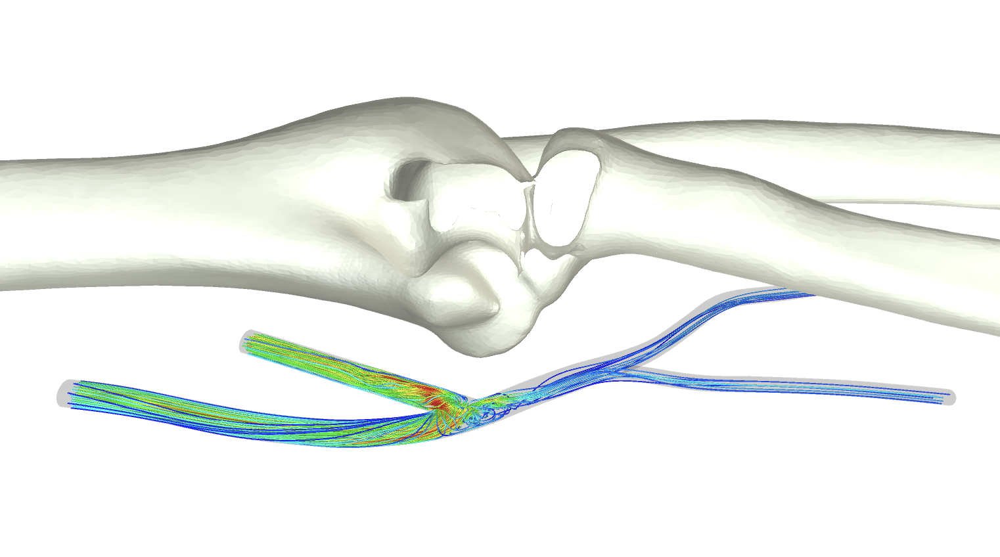

# Blood Flow Visualisation In VR Using Unity3D

## Context

I created this project as part of my summer research project with Prof Peter Vincent in 2017.
The project consisted in importing blood flow simulation data into Unity and visualising and animating them in virtual reality.
The structure of the code is explained in `project_description.pdf`.

## Usage

To edit the project and explore the code, clone this repository and open it with Unity. 
The project was created with Unity 5.6.2 and works best if opened with this version.

To interact with the simulation head over to `blood_flow_vr/Builds/AVF_game_VR`, a demo is shown below.

